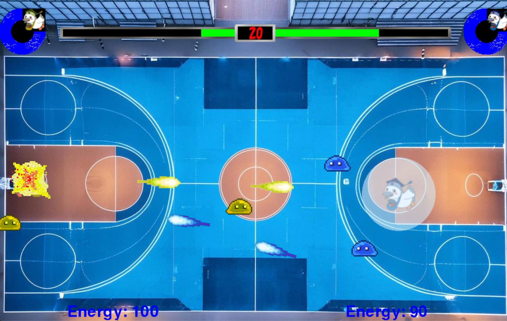

# HADO★kokaton!!

## 実行環境の必要条件
* python >= 3.10
* pygame >= 2.1

## ゲームの概要
* HADOを基盤とした2人用の対戦ゲーム！！
* ビームやバリアを駆使して相手を倒そう！！
* 体力が0になったら，ゲームオーバー！！

## ゲームの遊び方
* ２人用のゲームなのでプレイヤーごとにキーが違います！注意してね！
* ビームはチャージゲージがなくなると打てなくなるよ！SHIFT長押しでチャージしよう！

####  <プレイヤー1>
* 矢印キー　　　　　　 移動
* 矢印キー全押し　　　 バリアの発動
* 右SHIFT　　　　　　ビーム発射
* 右SHIFT長押し　　　  ビームチャージ
* 右Ctrl　　　　　 　 　必殺技

#### <プレイヤー2>
* WASD　　　　　　　　　移動
* WASDキー全押し　　　　バリアの発動
* 左SHIFT　　　　　　　 ビーム発射
* 左SHIFT長押し　　　　 ビームチャージ
* 左Ctrl　　　　　　　　　必殺技

## ゲームの実装
### 共通基本機能
* 背景画像(コート)
* プレイヤーの描画
* 2人用にする
* ビームの発射
* ビームの当たり判定

### 担当追加機能
#### 【】内はブランチ名
* 【CPU】CPUの参戦(宮島)：スライムが魔法陣で召喚される
* 【BGM】BGMと効果音の実装(宮島)：BGMやビームを打った時の効果音をつける
* 【barrier】バリアの追加(古賀)：指定キーを押下したときに自分の周りに無敵のバリアが発生
* 【skill】チャージ切り札(秦)：必殺技打つためのゲージと必殺技（玉が速くなる、相手コートに煙幕など）
* 【energy】エネルギーの追加と表示(岩永)：ビームを打つためのエネルギーチャージ
* 【HP】体力の追加：体力と体力ゲージの表示(高野)

### ToDo
- [ ] スタート画面の作成
- [ ] スキル時のカットイン演出
- [ ] プレイヤーごとにスキルの作成
- [ ] プレイヤーの選択画面

### 使うキー
####  プレイヤー1
* 矢印キー：移動
* 全矢印キーの同時押し：バリアの発動
* 右シフト：ビーム発射
* 右シフト長押しorビーム残量無し時の右シフト：ビームチャージ
* 右コントロール：必殺技

#### プレイヤー2
* WASD：移動
* WASDキーの同時押し：バリアの発動
* 左シフト：ビーム発射
* 左シフト長押しorビーム残量無し時の左シフト：ビームチャージ
* 左コントロール：必殺技

### スキルブランチについて
* スキルゲージの表示
* 一定時間経過でスキルゲージがたまる
* ゲージがたまっている状態でCtrlを押すとスキル使用
* スキルはバリアの無敵を無視する
* 通常のビームよりも攻撃力が高い

###  CPUブランチについて
* キャラクター１のCPU(青)とキャラクター２のCPU(黄)にそれぞれクラスを作成
* プレイヤーはCPUを倒すことができる、CPU同士に当たり判定はない
* CPUの跳ね返り時にランダムで速度が変わるように設定⇒毎回動きが変わる
* CPU_EffectクラスではCPUが登場するときの魔法陣を描画
* 魔法陣は時間経過で消える

###  BGMブランチについて
* プレイヤー１が勝ったときとプレイヤー２が勝った時のＢＧＭが異なるように設定
* 魔法陣からスライムが出てくるときにあわせて効果音をつけた

###  HPブランチについて
* プレイヤーにそれぞれHPを設定
* ビームが当たるとHPが減る
* HPが０になると敗北
* 視認性をよくするためHPバーを表示

###  バリアブランチについて
* 移動キー同時押しでバリアの発生
* バリア中は攻撃の無効化

###  エネルギーブランチについて
* ビームを打つのにエネルギーが必要
* 最大値は１００
* ビームを１回打つごとに１０減る

## ゲーム画面のスクショ

